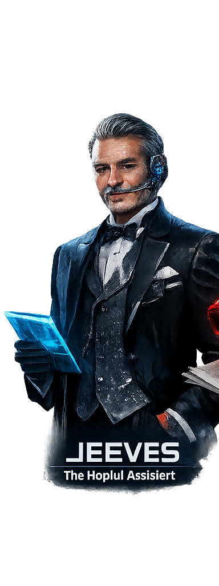
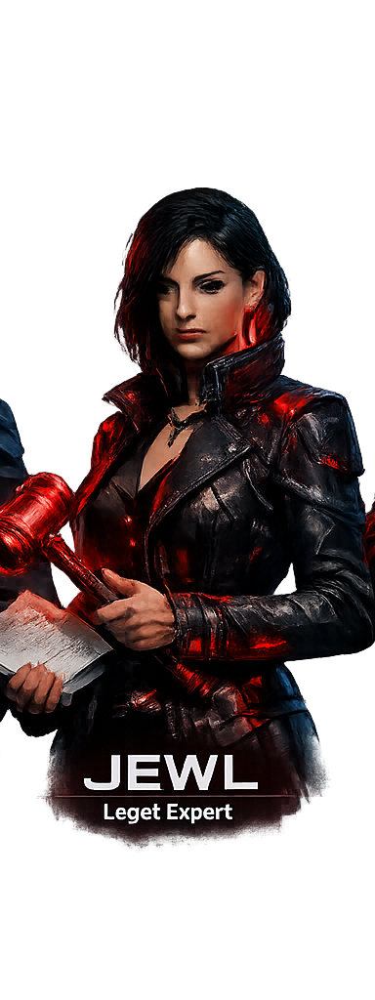
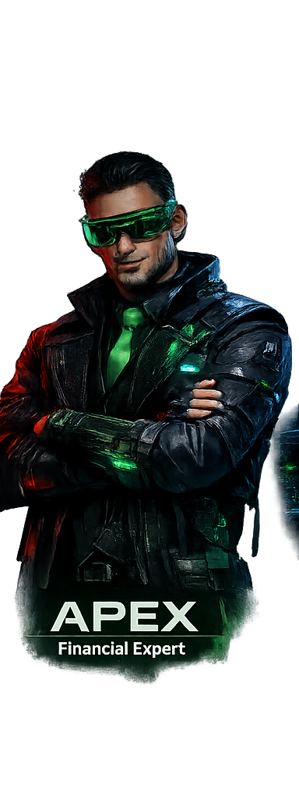
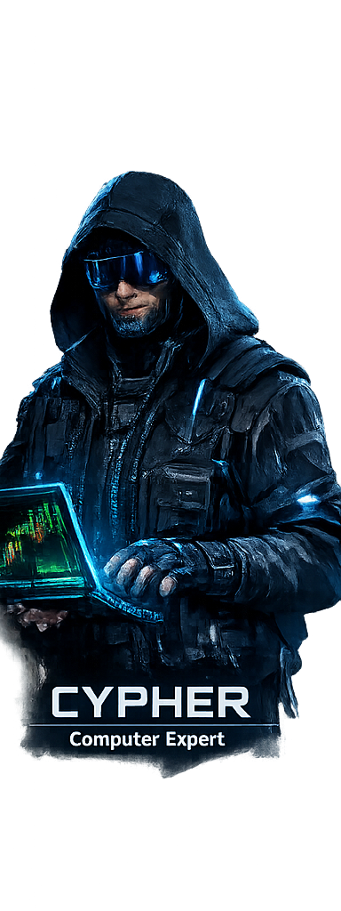

# 🤵 OpenJeeves — Personal AI Assistant

<p align="center">
  <picture>
    <source media="(prefers-color-scheme: dark)" srcset="docs/assets/openjeeves-logo-text-light.svg">
    
  </picture>
</p>

<p align="center">
  <strong>Your Personal AI Butler, Powered by Claude Code & OpenClaw</strong>
</p>

<p align="center">
  <a href="https://github.com/noktirnal42/openjeeves/actions/workflows/ci.yml?branch=main"></a>
  <a href="https://github.com/noktirnal42/openjeeves/releases"></a>
  <a href="LICENSE"></a>
</p>

**OpenJeeves** is a branded fork of [OpenClaw](https://github.com/openclaw/openclaw) enhanced with features from the open-source **Claude Code** leak. It combines the best of both worlds:

- ✅ **OpenClaw 2026.4.6+ features**: Multi-channel inbox, Gateway control plane, skills system
- ✅ **Claude Code integration**: Todo management, background agents, session memory, skills registry
- ✅ **Custom branding**: Purple/green theme, custom avatars, Jeeves identity
- ✅ **Model-agnostic**: Works with Ollama, LM Studio, OpenRouter (not locked to Anthropic)

## 👥 Meet the Agents

Our AI assistant comes with four specialized agents, each with a unique personality and role:

| Agent | Avatar | Role |
|-------|--------|------|
| **Jeeves** |  | General Assistant |
| **Jewel** |  | Verification Agent |
| **Apex** |  | Explorer Agent |
| **Cypher** |  | Planner Agent |

Each agent can be selected via the agent selector in the chat interface to tailor the AI's behavior to your task.

## ✨ Features

### Core OpenClaw Features
- **Multi-channel inbox**: WhatsApp, Telegram, Slack, Discord, Signal, iMessage, and more
- **Gateway control plane**: Single WS control for sessions, channels, tools, and events
- **Skills platform**: Bundled, managed, and workspace skills
- **Voice wake & talk**: macOS/iOS voice activation, Android voice mode

### Claude Code Enhancements
- **Todo management**: Structured task tracking with `todo_write`, `todo_read` tools
- **Background agents**: Spawn sub-agents with `task_create`, `task_stop`, etc.
- **Session memory**: Automatic conversation context logging
- **Skills registry**: Built-in skills for code review, debugging, testing, refactoring
- **Tool registry**: Unified tool system combining Claude Code tools with OpenClaw tools

### OpenJeeves Customizations
- **Custom branding**: Purple (#8b5cf6) and green (#22c55e) theme
- **Agent avatars**: Four custom avatars (Jeeves, Jewel, Apex, Cypher)
- **FiraCode Nerd Font**: Preferred monospace font
- **Custom favicon**: Hexagon logo with gradient

## 🚀 Quick Start

### Prerequisites
- **Node.js**: 22+ (24 recommended)
- **Package Manager**: pnpm, npm, or bun

### Installation

```bash
# Clone the repository
git clone https://github.com/noktirnal42/openjeeves.git
cd openjeeves

# Install dependencies
pnpm install

# Build the UI (required first time)
pnpm ui:build

# Build the backend
pnpm build

# Run the gateway
pnpm openclaw gateway run --bind loopback --port 18789
```

### Alternative: Use Pre-built Release

```bash
# Install OpenClaw first, then replace with OpenJeeves
npm install -g openclaw@latest

# Clone OpenJeeves and use local source
cd openjeeves
pnpm openclaw gateway run --bind loopback --port 18789
```

## 🔧 Configuration

OpenJeeves uses the same configuration structure as OpenClaw. Create `~/.openclaw/openclaw.json`:

```json5
{
  agent: {
    model: "openai/gpt-4.5", // or any supported model
  },
  channels: {
    discord: {
      token: "your-discord-bot-token",
    },
  },
}
```

### Supported Models
OpenJeeves works with multiple model providers:
- **OpenAI**: GPT-4.5, o3, o4-mini
- **Anthropic**: Claude (via built-in provider)
- **Ollama**: Local models
- **LM Studio**: Local models
- **OpenRouter**: Any model from the catalog
- And many more...

## 📖 Documentation

Full documentation is available at [docs.openjeeves.ai](https://docs.openjeeves.ai) (coming soon).

### Key Docs
- [Getting Started](docs/getting-started.md)
- [Configuration](docs/configuration.md)
- [Channels](docs/channels.md)
- [Tools](docs/tools.md)
- [Skills](docs/skills.md)
- [Security](docs/security.md)

## 🔨 Development

### Building from Source

```bash
# Full build (backend + UI)
pnpm build

# UI only
pnpm ui:build

# Run in development mode
pnpm gateway:watch
```

### Running Tests

```bash
# Run all tests
pnpm test

# Run specific test file
pnpm test src/agents/claude-code-integration/test.ts
```

## 🎨 Branding

### Colors
- **Primary**: Purple (#8b5cf6)
- **Secondary**: Green (#22c55e)
- **Background**: Dark (#0e1015)

### Fonts
- **Code**: FiraCode Nerd Font Mono
- **UI**: Inter

### Logo
The OpenJeeves logo is a hexagon with a purple-to-green gradient and "$" prompt, representing the fusion of Claude Code (the "leaked" version) with OpenClaw.

## 📝 License

OpenJeeves is MIT licensed, same as OpenClaw.

## 🙏 Acknowledgments

- **OpenClaw Team**: For building an amazing personal AI assistant
- **Claude Code**: For the leaked source code that inspired many features
- **Contributors**: Thanks to all who have contributed to this project

## 🔗 Links

- [GitHub](https://github.com/noktirnal42/openjeeves)
- [Documentation](https://docs.openjeeves.ai) (coming soon)
- [OpenClaw](https://github.com/openclaw/openclaw)
- [Discord](https://discord.gg/clawd)

---

<p align="center">
  <strong>OpenJeeves — Your Personal AI Butler</strong><br>
  🤵 Built with ❤️ using Claude Code + OpenClaw
</p>
